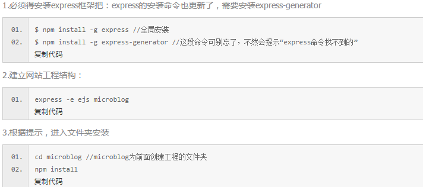

#自从上次写的一下子不见之后我知道了提交上传的重要性 （眼泪一地）##
##10/28/2015 6:08:35 PM （学习遇到的问题以及解决方法）
####关于js中getComputedStyle()的使用
eg：

    var element=document.getElementById("box");
    var a=window.getComputedStyle(element,null);//是该元素所有的CSS样式声明对象

但是在ie9以下不支持，ie中获取的方法是：

    var element=document.getElementById("box");
    var t= m.currentStyle.opacity;

所以来个通用的

    var element=document.getElementById("box");
	var t= m.currentStyle?m.currentStyle.opacity:window.getComputedStyle(m,null).opacity；
	//这是获取透明度；ie和chorm的方式是不同的
     obj.style.opacity=(t+speed)/100;  //chorm
     obj.style.filter='alpha(opacity.'+(t+speed/100)+')';  //ie;

####关于css的border，padding
浏览器最终出现的div的border，padding，margin等属性，是在浏览器读取了代码的值之后，最后加上的
eg:

		setInterval(function(){
		element.style.width=element.offsetWidth-1+'px';),30)
      
       此时css的设定里element的boder=1px；
       这时这个element不会减小反而增大；增大的速度是1；因为两边border各加1为2

###关于js里获取元素宽度
offsetwidth获取的是整个值，包括了padding，margin，border
如果想获取单纯的width 可以写在元素的行内或者用上面的那个getComputedStyle；

####js小数的取舍
Math.round();四舍五入
Math.floor(25.5);25
Math.ceil(25.5);26

####js对象的某个属性或者如果是个变量
 比如student是个对象里面有name age 属性，在某个页面用var attr存了name或者age，访问时不能
sutudent.attr;这样访问不到要用中括号student[attr]

####动画效果

1.   从CSS3来看
  
 -  三个基本属性(transition,animation,transform)
 -  transition:
 -  transform :要结合transition才有动画，它本身只是单纯的状态，支持3D
 -  transform有几个基础变化，rotate（80deg）旋转角度  translate(x,y)平移 skew()拉伸 scale(x,y)缩放都是基于transform: matrix(a,b,c,d,e,f);

ef控制位移
ad控制缩放
abcd控制旋转matrix(cosθ,sinθ,-sinθ,cosθ,0,0)
bc控制拉伸matrix(1,tan(θy),tan(θx),1,0,0)

2. 从JS来看（看函数库里的Action）

####css里的div包含img，底部出现缝隙（vertical-align和line-height。）####

		

在css代码中加入
       
      img{
        vertical-align: bottom;//文字并排

		}
或者
		
		  img{
        /*vertical-align: bottom;*/
        display: block;//文字跳行
    }
或者

	#box{
        background-color: #31b0d5;
        /*line-height:30px;*/
        /*display: inline-block;*/
    }

####css垂直居中####
html

	
xxx

css

    #box3{
        background-color: #31b0d5;
        line-height:600px;
        font-size: 0;
        width: 800px;
	;
    }

    img{
        vertical-align: middle;
        width:400px;
        height:300px;
        /*display: block;*/
    }

####css基本完全居中####
css代码：

       .box{
			  margin: auto;
			  position: absolute;
			  top: 0;
			  left: 0;
			  bottom: 0;
			  right: 0;
		}
html:
  
            

我喜欢的样子你都有

ps
可以在这个box里写文字(box设置position:relation)：

- 文字居中

css
 
	.box{
			  margin: auto;
			  position: absolute;
			  top: 0;
			  left: 0;
			  bottom: 0;
			  right: 0;
		}
		 .text{
            width: 50%;
            height:50%;
            overflow: hidden;
            margin: auto;
            position: absolute;
            left: 0;
            top: 0;
            bottom: 0;
            right: 0;
        }

- 文字靠右

      将上面left改为auto

####transition点击出现效果

eg：

css代码
		
		<input type="checkbox" id="button">
		<label class="ani" for="button"></label>
html代码
	
		input{display:none}
		.ani
	    	{
	    width:100px;
	    height:100px;
	    background:red;
	    transition:width 2s;
	    -moz-transition:all 2s; /* Firefox 4 */
	    -webkit-transition:all 2s; /* Safari and Chrome */
	    -o-transition:width 2s; /* Opera */
	    display:block;
	    }
	input:checked + .ani{width:300px;background-color:blue;}

####关于css中animate的position
CSS布局比较简单，通过background-position加载精灵图，做动画的元素都是需要设置position：absolute这样才能独立漂浮文档流，让页面的重绘更少

####生成随机数
第一步算出 m-n的值，假设等于w
第二步Math.random()*w
第三步Math.random()*w+n
第四步parseInt(Math.random()*w+n, 10)
生成n-m，不包含n但包含m的整数：​
第一步算出 m-n的值，假设等于w
第二步Math.random()*w
第三步Math.random()*w+n
第四步Math.floor(Math.random()*w+n) + 1
生成n-m，不包含n和m的整数：
第一步算出 m-n-2的值，假设等于w
第二步Math.random()*w
第三步Math.random()*w+n +1
第四步Math.round(Math.random()*w+n+1) 或者 Math.ceil(Math.random()*w+n+1)
生成n-m，包含n和m的随机数：
第一步算出 m-n的值，假设等于w
第二步Math.random()*w
第三步Math.random()*w+n
第四步Math.round(Math.random()*w+n) 或者 Math.ceil(Math.random()*w+n)

####js 中apply应用实例
1.找出一个数组中的最大数

 -   function getMax2(arr){
    return Math.max.apply(null,arr);
}

 - var arr1=[1,3,4];
var arr2=[3,4,5];
如果我们要把 arr2展开，然后一个一个追加到arr1中去，最后让arr1=[1,3,4,3,4,5]
arr1.push(arr2)显然是不行的。 因为这样做会得到[1,3,4,[3,4,5]]‘
Array.prototype.push.apply(arr1,arr2)

2.在一个方法中调用另外一个方法

####Array.prototype.slice.call
a.call(b) //b继承a
Array.prototype.slice.call(arguments)能将具有length属性的对象转成数组，除了IE下的节点集合（因为ie下的dom对象是以com对象的形式实现的，js对象与com对象不能进行转换）

			var a={length:2,0:'first',1:'second'};  //类数组对象
			Array.prototype.slice.call(a);//  ["first", "second"]
			 
			var a={length:2};
			Array.prototype.slice.call(a);//  [undefined, undefined]

####HTTP请求流程
1.Chorm搜索自身DNS缓存
2.搜索系统自身的DNS缓存（浏览器没有找到缓存或者已经失效）
3.读取本地的host文件
4.浏览器发起一个DNS的一个系统调用
   1.宽带运营服务器查看自身缓存
   2.运营商服务器发起一个迭代DNS请求（从com域到imooc.com）
     运营商服务器把结果返回操作系统内核同时缓存
     操作系统内核把结果返回浏览器
     浏览器得发ip地址
5.浏览器获得域名对应的ip地址后，发起三次http请求（三次握手）
6.tcp/ip建立链接后，浏览器可以向服务器发起http请求
7.服务器端接受请求，返回数据给浏览器 比如html代码
8.浏览器拿到代码然后渲染页面，渲染页面的时候里面的js，css，图片按照以上步骤获取
9.浏览器根据资源渲染页面

####网页加载
(1) 解析HTML结构。
(2) 加载外部脚本和样式表文件。
(3) 解析并执行脚本代码。
(4) 构造HTML DOM模型。//ready
(5) 加载图片等外部文件。
(6) 页面加载完毕。//load
eady与load那一个先执行，那一个后执行？答案是ready先执行，load后执行。

####addEventLisener
当一个事件发生时，分为三个阶段：

捕获阶段 从根节点开始顺序而下，检测每个节点是否注册了事件处理程序。如果注册了事件处理程序，并且 useCapture 为 true，则调用该事件处理程序。（IE 中无此阶段。）

目标阶段 触发在目标对象本身注册的事件处理程序，也称正常事件派发阶段。

冒泡阶段 从目标节点到根节点，检测每个节点是否注册了事件处理程序，如果注册了事件处理程序，并且 useCapture 为 false，则调用该事件处理程序。

举例

  

    

      

      

    

  

如果在 d3 上点击鼠标，事件流是这样的：

捕获阶段 在 div1 处检测是否有 useCapture 为 true 的事件处理程序，若有，则执行该程序，然后再同样地处理 div2。

目标阶段 在 div3 处，发现 div3 就是鼠标点击的节点，所以这里为目标阶段，若有事件处理程序，则执行该程序，这里不论 useCapture 为 true 还是 false。

冒泡阶段 在 div2 处检测是否有 useCapture 为 false 的事件处理程序，若有，则执行该程序，然后再同样地处理 div1。

注意，上述捕获阶段和冒泡阶段中，实际上 div1 之上还应该有结点，比如有 body，但这里不讨论。

 

 

  

    
请在此点击鼠标。

  

 

var outDiv = document.getElementById("outDiv");
var middleDiv = document.getElementById("middleDiv");
var inDiv = document.getElementById("inDiv");
var info = document.getElementById("info");
 
outDiv.addEventListener("click", function () { info.innerHTML += "outDiv" + " "; }, false);
middleDiv.addEventListener("click", function () { info.innerHTML += "middleDiv" + " "; }, false);
inDiv.addEventListener("click", function () { info.innerHTML += "inDiv" + " "; }, false);
上述是我们测试的代码，根据 info 的显示来确定触发的顺序，有三个 addEventListener，而 useCapture 可选值为 true 和 false，所以 2*2*2，可以得出 8 段不同的程序。

全为 false 时，触发顺序为：inDiv、middleDiv、outDiv；
全为 true 时，触发顺序为：outDiv、middleDiv、inDiv；
outDiv 为 true，其他为 false 时，触发顺序为：outDiv、inDiv、middleDiv；
middleDiv 为 true，其他为 false 时，触发顺序为：middleDiv、inDiv、outDiv；
……
最终得出如下结论：

true 的触发顺序总是在 false 之前；
如果多个均为 true，则外层的触发先于内层；
如果多个均为 false，则内层的触发先于外层。

总结：
事件进行捕获，目标，冒泡三个阶段
捕获阶段为true才执行该方法，
目标阶段无论false 还是tru都要执行
冒泡阶段false执行

####jq里each和map的区别
each返回的是原来的数组，并不会新创建一个数组。而map方法会返回一个新的数组。如果在没有必要的情况下使用map，则有可能造成内存浪费。

####深拷贝浅拷贝
浅拷贝：
var arr = ["One","Two","Three"];

var arrto = arr;
arrto[1] = "test";
document.writeln("数组的原始值：" + arr + " ");//Export:数组的原始值：One,test,Three
document.writeln("数组的新值：" + arrto + " ");//Export:数组的新值：One,test,Three
像上面的这种直接赋值的方式就是浅拷贝，很多时候，这样并不是我们想要得到的结果，其实我们想要的是arr的值不变，

解决办法：
方法的深拷贝
1.slice方法
var arr = ["One","Two","Three"];

var arrtoo = arr.slice(0);
arrtoo[1] = "set Map";
document.writeln("数组的原始值：" + arr + " ");//Export:数组的原始值：One,Two,Three
document.writeln("数组的新值：" + arrtoo + " ");//Export:数组的新值：One,set Map,Three

2:concat方法
var arr = ["One","Two","Three"];

var arrtooo = arr.concat();
arrtooo[1] = "set Map To";
document.writeln("数组的原始值：" + arr + " ");//Export:数组的原始值：One,Two,Three
document.writeln("数组的新值：" + arrtooo + " ");//Export:数组的新值：One,set Map To,Three

对象的深拷贝
js方法(类式继承)
var a={name:'yy',age:26};
var b=new Object();

b.name=a.name;
b.age=a.age;
a.name='xx';
console.log(b);//Object { name="yy", age=26}
console.log(a);//Object { name="xx", age=26}

jq方法；
  var a={name:{age:20}},b={};
$.extend(true,b,a);
b.name.age=9;
console.log(a.name.age);
console.log(b.name.age);//嵌套多层也不受影响

####null===undefined

####ie678解决xml解析问题
ActiveXObject

####apply和call的区别
ECMAScript规范给所有函数都定义了Call()与apply()两个方法，call与apply的第一个参数都是需要调用的函数对象，在函数体内这个参数就是this的值，剩余的参数是需要传递给函数的值，call与apply的不同就是call传的值可以是任意的，而apply传的剩余值必须为数组。

####JS中创建对象的几种常用方法

1. 简单对象字面量
这是最简单的创建对象的方法，也是经常在入门书籍中看到的方法：

//创建一个简单对象字面量
var person = {};    

// 加入属性和方法
person.name = 'ifcode';
person.setName = function(theName) {
   person.name = theName;
}
非常简单，但一般情况下不推荐这种方法。JS good parts书中认为这种写法可读性不够强，作者推荐的是后面一种写法。

2. 嵌套对象字面量
JS good parts中推荐这种写法:

var person = {
    name: 'ifcode',
    setName: function(theName) {
        this.name = theName;
    }
}
这种写法可读性很强，person对象的所有属性和方法都包含在其身体内，先的一目了然。

以上两种写法适用于只存在一个实例的对象，也就是某种意义上的singlton pattern。

下面介绍的几种方法比较适用于创建多个对象实例。

3. 简单构造函数
构造函数一般都符合factory pattern，根据默认的规则，构造函数应当首字母大写：

Person = function(defaultName) {
    this.name = defaultName;
    this.setName = function(theName) {
        this.name = theName;
    }
}

person = new Person('ifcode');
利用构造函数就可以方便地创建多个对象实例了。

4. 使用原型（prototype）的构造函数
这里简单回顾一下prototype的作用。prototype或许是某种意义上最接近传统OOP中class的东西了。所有创建在prototype上得属性和方法，都将被所有对象实例分享。

Person = function(defaultName) {
    this.name = defaultName;
}

Person.prototype.setName = function(theName) {
    this.name = theName;
}
其实创建对象的方法还有很多，这些过于灵活的方法也是许多人在初接触JS时感到困惑的原因。我个人比较偏向2和4：单一实例用2，多个实例用4。

####jqeury中queue和deferred的用处
defered更适合有一个异步的情况，这个操作成功进行什么操作，失败进行什么操作，在不同状态下的操作
queue更适合多个异步，比如动画的连续动作

####js中&&的优先级大于||

####jq使用ｃａｎｖａｓ失败

	var head=$("#head");
	var back=$("#back");
	var ca1=head.getContext("2d");//fish sust ui circle
	var ca2=back.getContext("2d");//background ane fruits

报错

	Ｍain.js:6 Uncaught TypeError: head.getContext is not a function(anonymous function) @ main.js:6］

报错原因以及修改方法

正确的代码如下：

	var head=$("#head")［０］;
	var back=$("#back")［０］;
	var ca1=head.getContext("2d");//fish sust ui circle
	var ca2=back.getContext("2d");//background ane fruits
原因：
jQuery()返回的是jQuery对象，而jQuery对象是没有getContext方法的，需要把jQuery对象转换成Dom对象，官方文档推荐的方法如上述代码，其实jQuery对象就是类数组，用数组下标可以取得Dom对象。

####让一个数的值在0-x之间变化####
m=n%x;

####关于立即执行函数
		(function(){
		eval("var x=10;y=20;");
		alert(x)
		})()

####js隔离作用域
		(function(){
		eval("var x=10;y=20;");
		alert(x)
		})
外部访问x失败undefined

####node.js学习
创建express并使用ejs模板

1.node 是单线程异步的（基于事件驱动的非阻塞I/O模型）
理解：我们写的js代码就像是一个国王，而nodejs给国王提供了很多仆人。早上，一个仆人叫醒了国王，问他有什么需要。国王给他一份清单，上面列举了所有需要完成的任务，然后睡回笼觉去了。当国王回去睡觉之后，仆人才离开国王，拿着清单，给其它的仆人一个个布置任务。仆人们各自忙各自的去了，直到完成了自己的任务后，才回来把结果禀告给国王。国王一次只召见一个人，其它的人就在外面排着队等着。国王处理完这个结果后，可能给他布置一个新的任务，或者就直接让他走了，然后再召见下一个人。等所有的结果都处理完了，国王就继续睡觉去了。直接有新的仆人完成任务后过来找他。这就是国王的幸福生活。

这段话对于理解nodejs的运行方式非常重要。

在nodejs中，有一个队列（先进先出），保存着一个个待执行的任务。第一个任务就是我们写的js代码，它最先被执行（相当于国王给第一个仆人任务清单）。在它执行完以后（国王睡回笼觉去了），其它的任务才会加到队列上（相当于第一个仆人按照清单给其它仆人分配任务）。

node,js 会先执行我们写的js代码里的东西，比如说遇到while的循环这些代码会顺序执行，执行完了再去执行调用的任务。

process.nextTick（）setImmediate()
process.nextTick() 中的的优先级要高于 setImmediate()
事件循环对观察者的检查是有先后顺序的， process.nextTick() 属于idle观察者，
setImmediate () 属于check观察者。在同一个轮循环检查中，idle观察者先于I/O观察者，I/O观察者
先于check先于I/O观察者。
可以将当前要执行的代码放到最后执行；
nextTick的确是把某任务放在队列的最后（array.push)
nodejs在执行任务时，会一次性把队列中所有任务都拿出来，依次执行
如果全部顺利完成，则删除刚才取出的所有任务，等待下一次执行
如果中途出错，则删除已经完成的任务和出错的任务，等待下次执行
如果第一个就出错，则throw error

		var async = require('async');
		var pushTask = function(name) { 
		    q.push(name, function(cb) { 
		        console.log('running: ' + name); 
		    }, function(err){ 
		        console.log('finished: ' + name); 
		    }); 
		}
		var wait = function(mils) { 
		    var now = new Date; 
		    while(new Date - now <= mils) ; 
		}
		var q = async.queue(function(name, task, callback) { 
		    console.log('processing task: ' + name); 
		    task(callback); 
		}, 3);
		pushTask('t1'); 
		pushTask('t2'); 
		pushTask('t3'); 
		pushTask('t4');
		wait(100); 
		console.log('waited 100ms');
		pushTask('t5'); 
		pushTask('t6'); 
		pushTask('t7'); 
		pushTask('t8');
		wait(10000); 
		console.log('waited 1000ms');

输出：

		waited 100ms 
		waited 1000ms 
		processing task: t1 
		running: t1 
		processing task: t2 
		running: t2 
		processing task: t3 
		running: t3 
		processing task: t4 
		running: t4 
		processing task: t5 
		running: t5 
		processing task: t6 
		running: t6 
		processing task: t7 
		running: t7
		processing task: t8
		running: t8

关于同步I/O 和异步I/O;

####nodejs需要大量计算cpu消耗大解决办法

将大量的计算用setImmediate（）进行分解；

####缓存穿透是什么
一般的缓存系统，都是按照key去缓存查询，如果不存在对应的value，就应该去后端系统查找（比如DB）。如果key对应的value是一定不存在的，并且对该key并发请求量很大，就会对后端系统造成很大的压力。这就叫做缓存穿透。

####缓存雪崩是什么
什么是缓存雪崩？

当缓存服务器重启或者大量缓存集中在某一个时间段失效，这样在失效的时候，也会给后端系统(比如DB)带来很大压力。

####响应式####
######图像随着缩放
方法一 

		img.rest{
    		max-width: 100%;
    		height: auto;
		}
说明：
设置图像元素100%占据其父元素的空间，当父元素随状态改变时，图片就会跟着改变，auto保持图片比例

方法二

			@media screen and (max-width:1024px ){
	    img.rest{
	  width: 50px;
	    }
	}
	@media screen and (min-width:1025px ) and (max-width: 1280px){
	    img.rest{
	        width: 200px;
	    }
	}
	@media screen and (min-width:1281px ){
	    img.rest{
	        width: 300px;
	    }
	}
	img.rest{
	    height: auto;
	}

说明：利用css逻辑条件判断，选择不同的显示像素

方式三：

说明：利用js找出频幕的分辨率，然后由php判断如何显示哪一种图返回给前端的页面；

####闭包，回调的理解
因为对于局部变量的访问，我们从函数外部是没办法直接访问的，但是我们可以使用闭包的方法，原理就是，因为里层可以访问外层，我们可以在这个a方法内部再写一个方法b，返回a方法里的值，再在a方法里将b方法返回，这样整个函数就可以返回a方法里的某个值了

	function a(){

	　　　　var n=999;
	
	　　　　function b(){
	　　　　　　alert(n); 
	　　　　}
	
	　　　　return b;
	
	　　}
		var result=a();
		result(); // 999

其中的b就是闭包

callback回：
大致就是当一个函数运行到callback的时候就调用这个方法
		
	function a(callback){
		var m=1;
        var n=2;
        var x=callback(m,n);
		alert(x);    //x=2
		}

		var y=a(function(m,n){
		return x=m*n;})
         

####关于enctype
为什么上传文件的表单里面要加一个属性ENCTYPE=MULTIPART/FORM-DATA？
首先知道enctype这个属性管理的是表单的MIME编码。共有三个值可选：
1、application/x-www-form-urlencoded
2、multipart/form-data
3、text/plain
其中application/x-www-form-urlencoded是默认值，作用是设置表单传输的编码。例如我们在AJAX中见过xmlHttp.setRequestHeader("Content-Type","application/x-www-form- urlencoded");如果不写会报错的，但是在html的form表单里是可以不写enctype=application/x-www-form-urlencoded,因为默认的HTML表单就是这种传输编码类型的。
而multipart/form-data是用来制定传输数据的特殊类型的，主要就是我们上传的非文本的内容，比如图片或是是mp3等等。
text/plain是纯文本传输的意思，在发邮件的时候要设置这种编码类型，否则会出现接收时编码混乱的问题。网络上经常拿text/plain和 text/html做比较，其实这两个很好区分，前者用来传输纯文本文件，后者则是传递html代码的编码类型，在发送头文件时才用得上。①和③都不能用于上传文件，只有multipart/form-data才能完整的传递文件数据

####关于数据la取，sse,websocket
sse和websocket合称为数据推送

  服务端事件发生频率越高或者需要低延迟越适合用sse或者websocket（频率低于1次一秒，二进制数据）

sse:多少时间进行一次推送和刷新？

EventSource对象并不能够自行设定刷新时间，这依赖于浏览器的具体实现，比如在Chrome中的刷新时间是3秒，但是在Firefox中刷新时间为5秒。

事实上，如果你可以控制服务器的话，可以在服务器端使用retry头信息，指定通信的最大间隔时间。

服务器收到请求时，并不会立即回复这个请求，只有当服务器需要推送数据的时候，才会以data:'message'这样的格式返回信息，但是此时利用的是分块传输机制刷新缓存，并不释放连接，以便下一次继续推送。

所以这里有一个坑需要注意，如果你的服务器使用的是Nginx而不是Apache，那么需要关闭相应请求的
buffer才能达到预期效果。

EventSource是html5监听后端更新的api 也就是说 ，触发的频率是由后端决定的
所以你可以设置后端更新为一秒一次就好了

####关于angularjs
value 是可以改变的
constant 是不可以改变的
factory 是可以定义一个方法，但是要在调用的时候实例化
service 是已经实例化的factory可以直接调用

####cdn
1.是什么？
CDN的全称是Content Delivery Network，即内容分发网络。CDN的通俗理解就是网站加速，CPU均衡负载，可以解决跨运营商，跨地区，服务器负载能力过低，带宽过少等带来的网站打开速度慢等问题
说白了就是把内容存到到不同地域的不同线路服务器上，根据用户发起访问请求分布，CDN在离用户最近的地域相同的线路服务器上获取内容，反馈给用户。
比如head里面请求了jQuery的url，如果一个很遥远的地方来访问，就会各种慢，但是可以购买网上的cdn里服务，就可以把这些东西包括图片什么的都放进去，这样用户就会就近取得资源缓存了
2.什么作用？
用户体验好，而且分流负载，降低服务器负载压力

####new 一个没有参数的构造函数

(new function)

#####js自执行函数

方法一：(function(){alert(1);}()); 这是jslint推荐的写法，好处是，能提醒阅读代码的人，这段代码是一个整体。 
例如，在有语法高亮匹配功能的编辑器里，光标在第一个左括号后时，最后一个右括号也会高亮，看代码的人一眼就可以看到这个整体。 

方法二：(function(){alert(1);})(); function外面加括号

方法三：!function(){alert(1);}(); function前面加运算符，加上“!”或“+” “~”等运算符，写起来是最简单的

####防止页面刷新重复提交数据
1。重复刷新、重复提交 
Ways One：设置一个变量，只允许提交一次。 
		
		 
	<form action="action.php" method="post" onsubmit="getElById('submitInput').disabled = true;return true;">　
	
	</form>

2。防止用户后退 
这里的方法是千姿百态，有的是更改浏览器的历史纪录的，比如使用window.history.forward()方法;有的是“用新页面的URL替换当前的历史纪录，这样浏览历史记录中就只有一个页面，后退按钮永远不会变为可用。”比如使用javascript:location.replace(this.href); 

F5刷新重复提交上一次的表单，这是个常见的问题。可以用hidden和session做一个同步标识，初始化hidden和session中的标识相同，在页面回传时只需要判断这2个标识是否相同，如果相同则正常执行，同时刷新hidden和session中的标识值；如果2个标识中的值不相等，说明hidden的值是上一次的表单内容，属于刷新行为

####判断一个变量obj是对象还是数组，然后给另一个变量ret赋类型
		if(b=((obj instanceof Array))||obj instanceof Object){
			ret=b?[]:{};
}

####AMD CMD ES6
 AMD（是RequireJS推广过程中对模块定义的规范化产物）:
	 1，异步加载模块，依赖前置；提前执行；（在最开始全部加载好了，代码也分析好了，直接调用）
     2，Define定义模块
			define(['require','foo'],function(){return})
     3，require加载模块（依赖前置）
			require(['foo','bar'],function(foo，bar){})
 CMD（SeaJS推广过程中对模块定义的规范化产物）:
	 1，同步加载模块，依赖就近，延迟执行（是在需要用的时候才来加载）
	 2，Define定义模块
            define(function(require,exports,module){});
				module上存储了当前模块上的对象
	 3，require(./a)直接引入,或者Require.async异步引入

#### js高级函数 ####
1.级联函数：
就是在方法的末尾返回该对象；
eg：
传统方法 ：
		
		  function Person(){
        this.head="";
        this.body="";
        this.foot="";
    }
    Person.prototype={
         setHead:function(head){
             this.head=head;
             console.log("我的脸是"+this.head);
        },
        setBody:function(body){
            this.body=body;
            console.log("我的身体是"+this.body);
        },
        setFoot:function(foot){
            this.foot=foot;
            console.log("我的脚是"+this.foot);
        }

    };
    var cc=new Person();
    cc.setHead("圆圆的");
    cc.setBody("瘦瘦的");
    cc.setFoot("直直的");

用联级函数改变后：

		 function Person(){
        this.head="";
        this.body="";
        this.foot="";
    }
    Person.prototype={
         setHead:function(head){
             this.head=head;
             console.log("我的脸是"+this.head);
             return this;
        },
        setBody:function(body){
            this.body=body;
            console.log("我的身体是"+this.body);
            return this;

        },
        setFoot:function(foot){
            this.foot=foot;
            console.log("我的脚是"+this.foot);
            return this;

        }

    };
    var cc=new Person();
		//    cc.setHead("圆圆的");
		//    cc.setBody("瘦瘦的");
		//    cc.setFoot("直直的");
    cc.setHead("圆圆的").setBody("瘦瘦的").setFoot("直直的");

2.惰性函数
个人理解：就是第一次判断的时候，将判断之后的结果放在新建的与这个方法同名的函数中
如下面	
			
				createXHR = function () {
                    return new XMLHttpRequest();
                }

而且记得要返回两次；

			createXHR = function () {
                    return new XMLHttpRequest();
            }
            return new XMLHttpRequest();

第二次才是真的执行

旧方法：

    function createXHR(){
	    if (typeof XMLHttpRequest != "undefined"){
	        return new XMLHttpRequest();
	    } else if (typeof ActiveXObject != "undefined"){
	        if (typeof arguments.callee.activeXString != "string"){
	            var versions = ["MSXML2.XMLHttp.6.0", "MSXML2.XMLHttp.3.0",
	                            "MSXML2.XMLHttp"];
	    
	            for (var i=0,len=versions.length; i < len; i++){
	                try {
	                    var xhr = new ActiveXObject(versions[i]);
	                    arguments.callee.activeXString = versions[i];
	                    return xhr;
	                } catch (ex){
	                    //skip
	                }
	            }
	        }
	    
	        return new ActiveXObject(arguments.callee.activeXString);
	    } else {
	        throw new Error("No XHR object available.");
	    }
	}

新方法：

	function createXHR() {
            if (typeof XMLHttpRequest != "undefined") {
                createXHR = function () {
                    return new XMLHttpRequest();
                }
                return new XMLHttpRequest();
            } else if (typeof ActiveXObject != "undefined") {
                var curxhr;
                var versions = ["MSXML2.XMLHttp.6.0", "MSXML2.XMLHttp.3.0",
                    "MSXML2.XMLHttp"];

                for (var i = 0, len = versions.length; i < len; i++) {
                    try {
                        var xhr = new ActiveXObject(versions[i]);
                        curxhr = versions[i];
                        createXHR = function () {
                            return new ActiveXObject(curxhr);
                        }
                        return xhr;
                    } catch (ex) {
                        //skip
                    }
                }
            } else {
                throw new Error("No XHR object available.");
            }
        }

3.柯里化函数

通用版：
		function currying(fn) {
            var slice = Array.prototype.slice,
            __args = slice.call(arguments, 1);//将类数组对象化成数组
            return function () {
                var __inargs = slice.call(arguments);
                return fn.apply(null, __args.concat(__inargs));
            };
        }

柯里化函数有3个特点
- 延迟执行  比如说要累加计算之类

			var curryWeight = function(fn) {
		    var _fishWeight = [];
		    return function() {
		        if (arguments.length === 0) {
		            return fn.apply(null, _fishWeight);
		        } else {
		            _fishWeight = _fishWeight.concat([].slice.call(arguments));
		        }
		    }
		};
		var fishWeight = 0;
		var addWeight = curryWeight(function() {
		    var i=0; len = arguments.length;
		    for (i; i<len; i+=1) {
		        fishWeight += arguments[i];
		    }
		});
		
		addWeight(2.3);
		addWeight(6.5);
		addWeight(1.2);
		addWeight(2.5);
		addWeight();    //  这里才计算
		
		console.log(fishWeight);    // 12.5

延迟执行：

		var obj = {
    		"name": "currying" 
		},
		fun = function() {
    		console.log(this.name);
		}.bind(obj);		//已经绑定了

		fun(); // currying 这里才执行
    
bind的实现：
	if (!function() {}.bind) {
    		Function.prototype.bind = function(context) {
    	   		 var self = this，
           	 	 args = Array.prototype.slice.call(arguments);
       			 return function() {
        	    	return self.apply(context, args.slice(1));    
       	 	 	 }
    		};
	}

- 使参数合法化
- 提前返回

#### 构造函数与 普通函数 区别
构造函数：
1.默认return new出来的对象；当显式return时，分两种情况：
  - return的是五种简单数据类型：String，Number，Boolean，Null，Undefined。
这种情况下，忽视return值，依然返回this对象。
  - eturn的是Object
这种情况下，不再返回this对象，而是返回return语句的返回值。
2.this（指新的对象）；
3.首字母大写
普通函数；
1.需要指定return返回；
2.this（windows全局）；
3.驼峰式命名，首字母小写

####js按引用传递 按值传递
 按引用传递：object 和 array
 按值传递：string Boolean int···········

